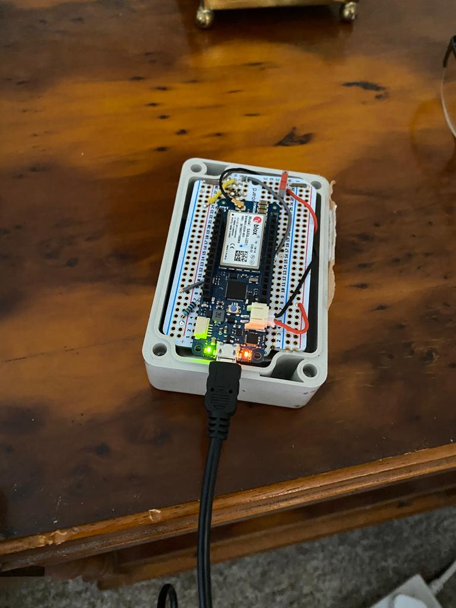

# Equine-Foaling-Alarm
> Arduino Equine Foaling Alarm - Aids foaling by sending an SMS to your phone, alerting if a foal is due.

Using a GSM enabled Lithium-Ion powered Arduino board to monitor tilt. 

The principle is simple. 

The device is attached to the headcollar of the mare in foal and when the mare lies down on her side (which is normally one of the few times a horse lies on its side), the device senses this and after 15, 30 and 60 seconds sends out an SMS to a hard coded phone number, alerting that the tilt sensor has been tripped. 

False positives can happen, however this is common with most other systems and is preferable to the alternative.

This project was inspired by: https://create.arduino.cc/projecthub/pittex/foaling-monitor-139532

Arduino MKR GSM 1400 was used for this project.

Only the sourcecode has been put on here, as short a explanation of the project which was worked on summer 2020. 

Foal Alarm in Action (links to YouTube): 

Arduino Board in container:

Foal Alarm mounted on headcollar:

Foal born with help of Foal Alarm:

