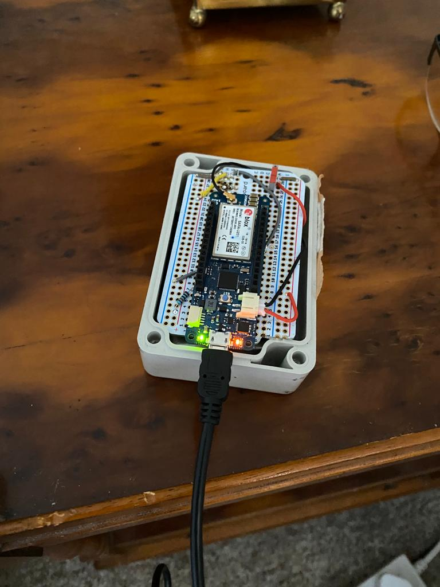
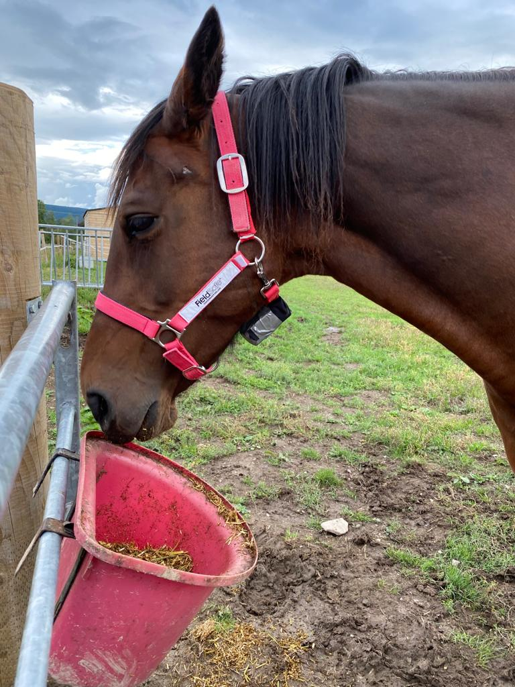

# Equine-Foaling-Alarm
> Arduino Equine Foaling Alarm - Aids foaling by sending an SMS to your phone, alerting if a foal is due.

Using a GSM enabled Lithium-Ion powered Arduino board mounted on the mare's headcollar to detect foaling behaviour and alert by SMS.

The principle is simple.

When the mare lies down on her side (which is normally one of the few times a horse lies on its side), the device senses this and sends an SMS to your phone. False positives can happen, however this is common with most other systems and is preferable to the alternative.

Arduino MKR GSM 1400 was used for this project.

## 2026 upgrade programme

The original tilt-switch build (2020) is being upgraded — see **[docs/UPGRADE-PLAN.md](docs/UPGRADE-PLAN.md)** for full detail, wiring diagrams and current status:

1. **MPU-6050 motion sensor** — replaces the tilt switches; detects the *behaviour* of labour (lying flat **and** moving, restless up/down cycles) instead of position alone, so REM-sleeping mares no longer trigger false alarms. Three alarm tiers: labour, long-flat backstop, early restlessness warning.
2. **Battery monitoring** — voltage divider + daily "I'm alive" heartbeat SMS with battery %, plus a low-battery warning. A missing heartbeat itself means the unit needs checking.
3. **External charging socket** — waterproof panel-mount USB-C socket wired to the board's 5V pin, so the box never needs opening to charge.

Current firmware: [`GiiFoalAlarm.ino`](GiiFoalAlarm.ino) (MPU-6050 rewrite).
Previously deployed tilt-switch firmware: [`legacy/GiiFoalAlarm-tilt-2022.ino`](legacy/GiiFoalAlarm-tilt-2022.ino).

### Building

- Board: Arduino MKR GSM 1400 (`MKRGSM` library).
- Install the **MPU6050_light** library (Library Manager).
- Copy `arduino_secrets.h.example` to `arduino_secrets.h` and fill in your SIM PIN and alert phone number (the real file is gitignored).
- Calibrate the accelerometer axis before field use — procedure in the upgrade plan.

## The original build (2020)

This project was inspired by: https://create.arduino.cc/projecthub/pittex/foaling-monitor-139532

The device was attached to the headcollar of the mare in foal and when the mare lay on her side, a tilt switch tripped and after 15, 30 and 60 seconds an SMS was sent. Worked on summer 2020.

Foal Alarm in Action (links to YouTube):

Arduino Board in container:

Foal Alarm mounted on headcollar:

Foal born with help of Foal Alarm:

